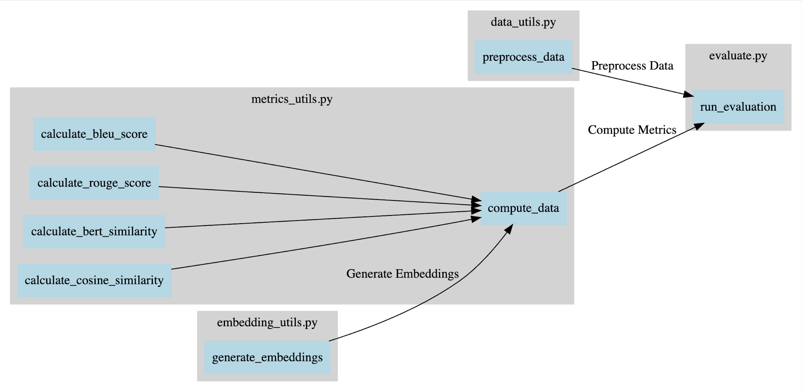

# GenAI Evaluation Library

## Motivation

The **GenAI Evaluation Library** is designed to provide comprehensive evaluation metrics for generated text, enabling better assessment of language models and their outputs. This library is developed to streamline the process of evaluating AI-generated text against various benchmarks and metrics, ensuring that developers can effectively measure and improve their models.

## Metrics Covered

This library supports the following evaluation metrics:

### 1. BLEU Score
- **Description**: Measures the precision of n-grams in the generated text compared to reference texts, focusing on bi-grams in this implementation.
- **Reference**: [BLEU Score Documentation](https://en.wikipedia.org/wiki/BLEU)

### 2. ROUGE Score
- **Description**: Evaluates the overlap between n-grams in the generated text and reference text, including ROUGE-1 and ROUGE-L scores.
- **Reference**: [ROUGE Score Documentation](https://www.aclweb.org/anthology/W04-1013/)

### 3. BERT Similarity
- **Description**: Measures semantic similarity between the generated text and reference text using BERT embeddings.
- **Reference**: [BERT Paper](https://arxiv.org/abs/1810.04805)

### 4. Cosine Similarity
- **Description**: Computes cosine similarity between embeddings of the reference and generated texts.
- **Reference**: [Cosine Similarity](https://en.wikipedia.org/wiki/Cosine_similarity)

## Parameters Considered

- **BLEU Score**: Uses Smoothing Method 4 to handle cases where n-gram overlaps are zero.
- **ROUGE Score**: Includes ROUGE-1 and ROUGE-L metrics.
- **BERT Similarity**: Utilizes pre-trained BERT model for generating embeddings.

## Library/Project Structure

genaievaluation/
├── __init__.py
├── genaievaluation/
│   ├── __init__.py
│   ├── data_utils.py
│   ├── embedding_utils.py
│   ├── metrics_utils.py
│   └── evaluate.py
├── .gitignore
├── README.md
├── requirements.txt
└── setup.py

### Project Structure

- **`__init__.py` (Root Directory)**
  - Initializes the `genai_evaluation` package, making it recognizable as a Python package.

- **`evaluation/`**
  - **`__init__.py`**
    - Initializes the `evaluation` module for internal imports.
  - **`data_utils.py`**
    - Contains functions for data preprocessing, such as cleaning and transforming data.
  - **`embedding_utils.py`**
    - Includes methods for generating embeddings used in the evaluation process.
  - **`metrics_utils.py`**
    - Provides functions for computing various evaluation metrics (e.g., BLEU score, ROUGE score, BERT similarity).
  - **`evaluate.py`**
    - Houses the `run_evaluation` function that integrates preprocessing, embedding generation, and metrics computation.

- **`.gitignore`**
  - Specifies files and directories to be ignored by Git, such as temporary files and virtual environment directories.

- **`README.md`**
  - Provides a comprehensive guide to the library, including installation instructions, usage examples, and project information.

- **`requirements.txt`**
  - Lists the dependencies required for the project to ensure that all necessary packages are installed.

- **`setup.py`**
  - Configures the package setup, including metadata and dependencies, to facilitate installation and usage as a package.

## Dependencies / Requirements

- **Data Handling**: pandas, numpy
- **Embeddings and NLP**: sentence-transformers, transformers, nltk
- **Metrics**: rouge-score, scikit-learn
- **Deep Learning**: torch
- **Miscellaneous**: tqdm

## Graphical Representation of the Project

The project structure and flow of data through various methods can be visualized as follows:

